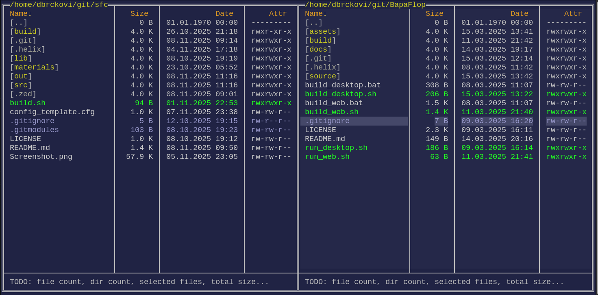

# Simple-File-Commander
Orthodox TUI file manager inspired by Norton/Total/Midnight/Double Commander and Helix editor motions. 

!!!Barely started development!!!

# Important TODO:

 - [-] Decide if Control will be bindable because gnome terminal intercepts C-j, C-l, C-o, etc.
       or try to update TermCL
 - [-] Sorting seems to work only for names
 - [-] Make key mapper (load from file, default if not found)
 - [-] decide if mod keys will be strict or flexible
       maybe...
       x = execute when x is pressed regardless of modifiers
       N-x = execute only when x is pressed alone
       A-x = execute only when Alt+x is pressed
       S-x = execute only when Shift+x is pressed
       C-x = execute only when Ctrl+x is pressed
       A-C-x = execute only when Ctrl+Alt+x is pressed
 - [-] Make command sub-system (parser, executor, show results/errors)
 - [-] Make text viewer "popup"
 - [-] Make commands which can be called from key mapper or from command sub-system
 - [-] Execute file and show output somewhere
 - [-] show/hide hidden items
 - [-] remember "last session" (directories, panels, hidden files etc)
 - [-] file "icons" left of the file/directory
 - [-] color coded file and directory names based on pattern
 - [+] file attributes
   - [+] draw file attributes with different color for each permission set
   - [-] draw file attributes in octal mode
 - [+] get file attributes from parent directory
 - [-] handle system files
 - [-] detect if file was cropped, and draw it differently (probably using "icon" column)
 - [-] hex_to_rgb is ignoring errors
 - [-] symbolic links
        - differentiate links to directories and files
        - follow them on enter
        - show target in status area if focused file is link
        - paint links based on target 'stat' (icon_link_to_directory is now unused)
   
# Cleanup TODO:

 - refactor 'compare' procedures. There are too many doing very similar thing
 - Make drawing procedures consistent
    - some take temp_clor, some don't
    - some take colors, some don't

# Screenshot

